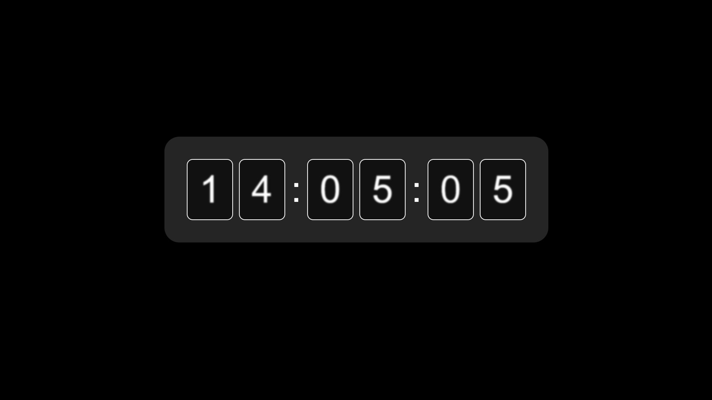

# Clock

## intro 
This project is a clock where each digit moves like a slot machine(but in a horizontal way). I also added a blur effect and a small side-to-side movement to make it feel like sitting on a fast-moving train, where the view outside the window becomes blurry as it passes by. The blur animation lasts three seconds, so when it clears, the seconds appear to jump forward (for example from s to s+3). This creates a feeling that time is moving differently. It reflects the experience of being on a train, where time can feel slower and you become more aware of each moment.