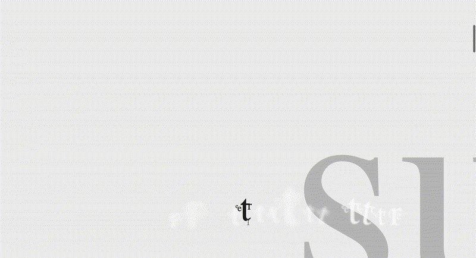
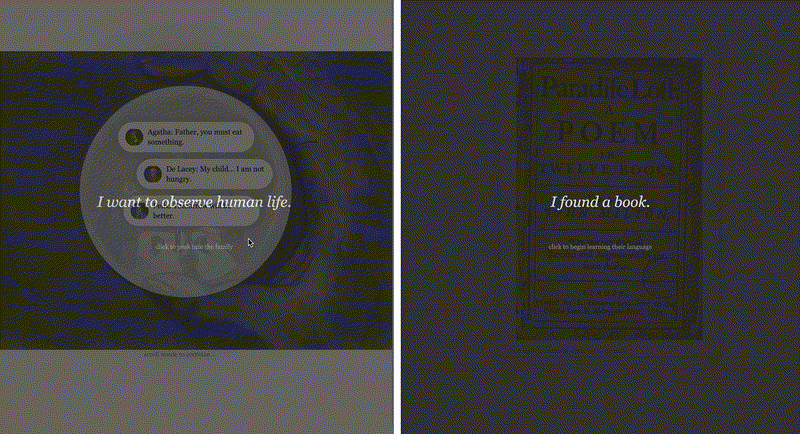

# Awakening
**A web adaptation of Frankenstein through interaction and language** by *Rachel Li*

## Short Description

An interactive website inspired by the creature’s early experiences in Frankenstein. Through scrolling, hovering, sound, and changing text, the viewer slowly learns to see and understand the world alongside the creature.

## Abstract

This project adapts parts of Frankenstein, focusing on the creature’s awakening and gradual discovery of human language. Instead of retelling the novel directly, the story is translated into an interactive web experience where meaning emerges through movement, pacing, and interaction.

The first section explores sensation and survival through scrolling and environmental interaction. The second section follows the creature observing the De Lacey family and learning language through fragmented letters, shifting words, and emotional associations.

## Demo

*wandering through the environment*

*language learning process*

