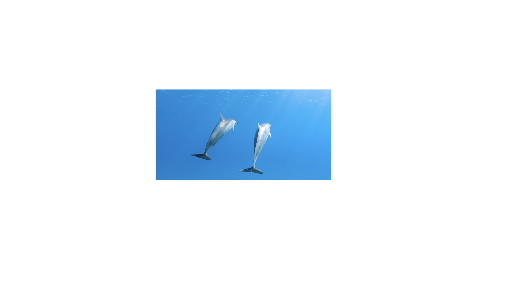
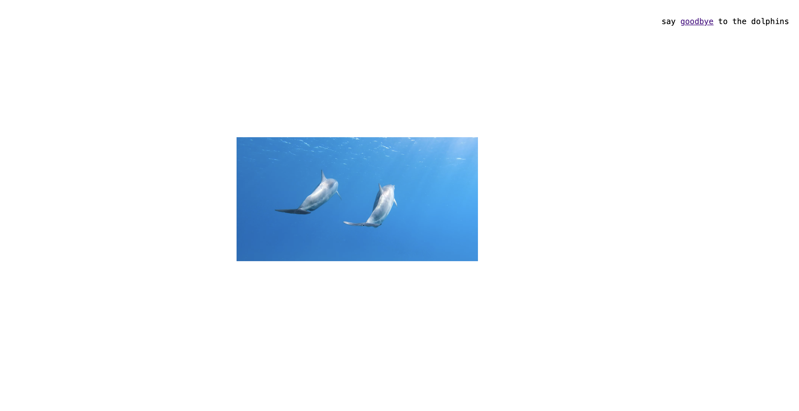

# How to travel time?

## brief intro 
The story begins with raising the question of how to travel time and instructions are provided by the clock step by step. There are in all only six steps and mainly the steps are mainly listed on the left hand side of the screen acting as a todo/check list. Usually the "next step" is shown once the latest step is completed and thus the story proceeds. Clicking is the main way to proceed and some scrolling is also needed when it is intended to explore the space.

## interaction features
The "swim with dolphins" section is intended to act like a frame-by-frame animation where clicking on one of the two images guides to the other (endlessly) and should be something that can be played with for a while. However, it is unclear whether the audience discovers it can be played in this way (and even enjoy this or not) because there has to be an exit on one of the pages.

 

Another feature is the museum "target the time machine" task where I used a useful word-search <a href="https://puzzlemaker.discoveryeducation.com/word-search/">website</a> to make the word puzzle. The puzzle consists of many collections to create a feeling of being surrounded by them in an actual museum. Clicking on each of them will guide the user to view that specific collection but the goal is to find the word time machine and then proceed.